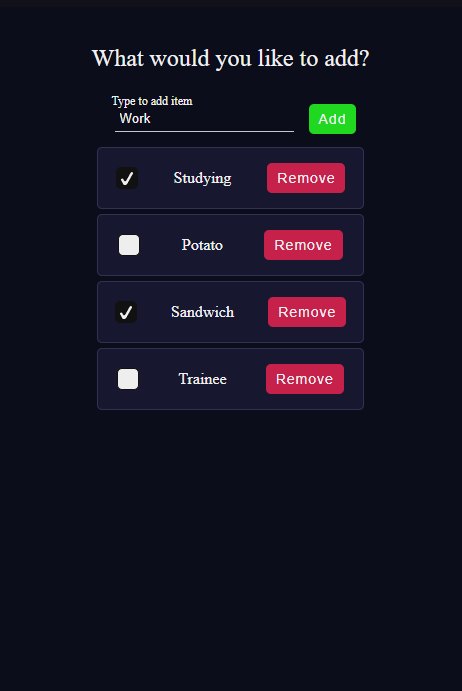
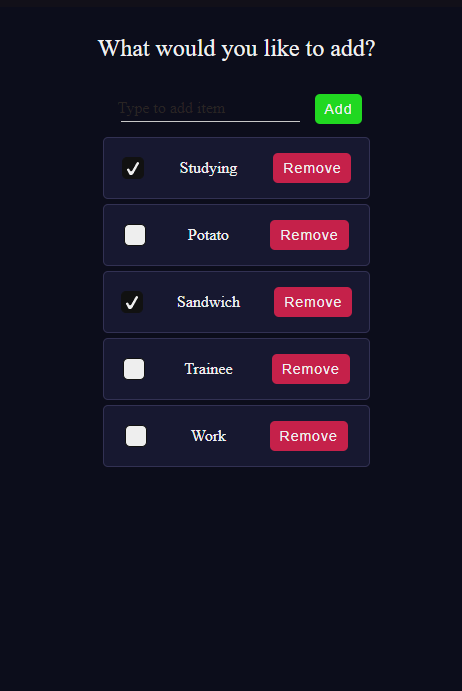

# Documentação do Projeto To Do

## Ferramentas Utilizadas no ReactJS

O projeto utiliza as seguintes bibliotecas:

- [react](https://www.npmjs.com/package/react) - Biblioteca principal do React.
- [react-hook-form](https://www.npmjs.com/package/react-hook-form) - Para gerenciamento de formulários.
- [react-router-dom](https://www.npmjs.com/package/react-router-dom) - Para roteamento no React.
- [web-vitals](https://www.npmjs.com/package/web-vitals) - Para monitoramento de performance da aplicação.

## Mecânica de Adicionar e Remover Elementos

A funcionalidade de adicionar e remover elementos é organizada utilizando uma estrutura modular, onde funções utilitárias são armazenadas na pasta `utils`.

- Adicionar Elemento)
- Remover Elemento

### Adicionar Elemento
A adição de elementos é feita por meio de uma função na pasta `utils`, garantindo a reutilização do código.

### Remover Elemento
A remoção segue o mesmo princípio da adição, utilizando uma função separada para melhor organização do código.

## Estrutura de Pastas

O projeto segue uma organização clara para facilitar a manutenção:

- `assets/` - Contém imagens, ícones e outros arquivos estáticos.
- `components/` - Contém os componentes reutilizáveis da aplicação.
- `pages/` - Contém as páginas principais do aplicativo.
- `utils/` - Contém funções auxiliares, como adicionar e remover elementos.
- `NotFound.js` - Página de erro 404 para rotas inexistentes.

